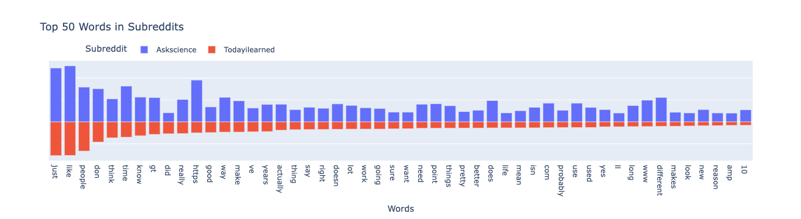
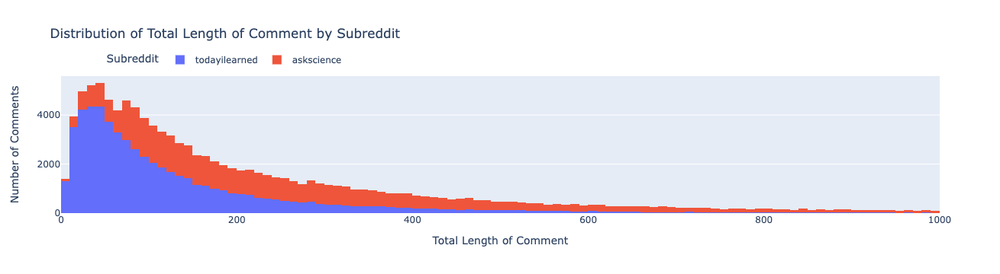
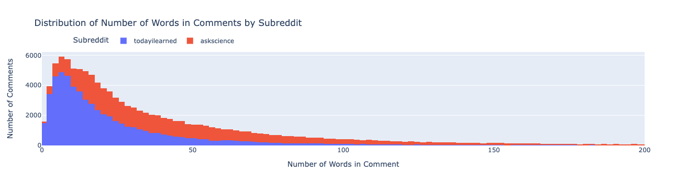
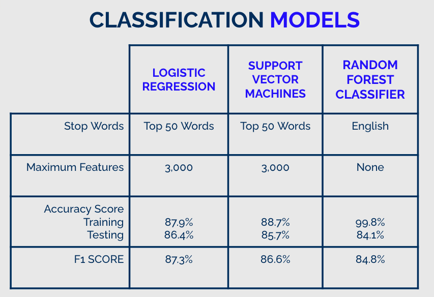

# ASKING or ANSWERING? NLP MODELING PROBLEM

## Executive Summary
### Table of Contents
| Topic | Description | Link |
| --- | --- | --- |
|Data Collection| Pushshift API Jupyter Notebook | [LINK](./Pushshift_API.ipynb)
|Data Cleaning and Preliminary Analysis | EDA Jupyter Notebook | [LINK](./EDA.ipynb)
|Data Modeling  |Modeling Jupyter Notebook | [LINK](./modeling.ipynb)
|Data | Folder | [LINK](./data/)
|Saved Models | Folder | [LINK](./models/)
|Visuals | Folder | [LINK](./visuals/)

### Problem Statement
Are you answering a question or responding to a statement stating information?  The problem is to determine whether a written statement is answering a question or in response to a statement. I will create a model to determine whether a written statement is answering a question or commenting on the information provided.
1. Collection of comments from Reddit.com
2. Classification Model of Natural Language Processing
3. Metrics of Success based on accuracy and f1-score.

### Description of Data
The comments were collected from 2 subreddits from Reddit.com [r/askscience](./data/askscience.csv) and [r/todayilearned](./data/todayilearned.csv) using the [Pushshift API](https://github.com/pushshift/api). The submissions in r/askscience ask a question about science. There are 21.4 million members in the subreddit. The subreddit is highly monitored so unrelated posts are removed. Over 100,000 posts were collected to obtain 56,000 unique, related posts.

The submissions in r/todayilearned state information. There are 26.3 million members in the subreddit. The subreddit is as well monitored so unrelated comments that made it through the sensors were removed. Over 62,000 posts were collected to obtain 59,000 unique, related posts.

The target is the subreddit. The model is looking to classify the comment as coming from either r/askscience or r/todayilearned.

The top 100 words from both subreddits were reviewed, without stopwords from Count Vectorize. 50 of these words were in the top 100 of both subreddits. This list of 50 words became the stop words that were used in most of my models. The stopwords from Count Vectorize  did perform better in one model type.

The average comments from r/askscience  has a length of almost 400 and over 65 words. The average comment form r/todayilearned length was over 150 and over 25 words.

| Feature | Type | Dataset | Description |
| --- | --- | --- | --- |
| subreddit | object |[Data](/.data/combined_data.csv) | name of the subreddit
| body | object | [Data](/.data/combined_data.csv) | comment on the subreddit submission
| author | object | [Data](/.data/combined_data.csv) | name of the author of the comment
| created_utc |  int | [Data](/.data/combined_data.csv) | date of comment in coordinated Universal Time (UTC)
| body_lenght | int | [Data](/.data/combined_data.csv) | lenght of the comment
| body_word_count | int |[Data](/.data/combined_data.csv)| number of words of the comment

### Model Performance 
The baseline accuracy is 50% since both subreddits are evenly represented in the data. CountVectorizer was used for preprocessing. Depending on the models, either top 50 words and English stopwords words were used as stopwords. The maximum features were limited to 3,000 for Logistic Regression and SVM. Limiting the maximum features created models with the highest accuracy for both the training and testing data. There was a balance between finding a model that is accurate and not over fitting. The table belows summarizes the best model for each type of model. 

### Conclusions

### Next Steps
* Faster computer to determine bi_grams. The kernel in the jupyter lab would die when I would try to run this.
* Explore the top predicting words.
* Expand modeling to other subreddits. There are other subreddits that post information and ask questions.
* Create a website on the cloud to classify comments based on subreddit rather than demonstrate the website from the local host.
